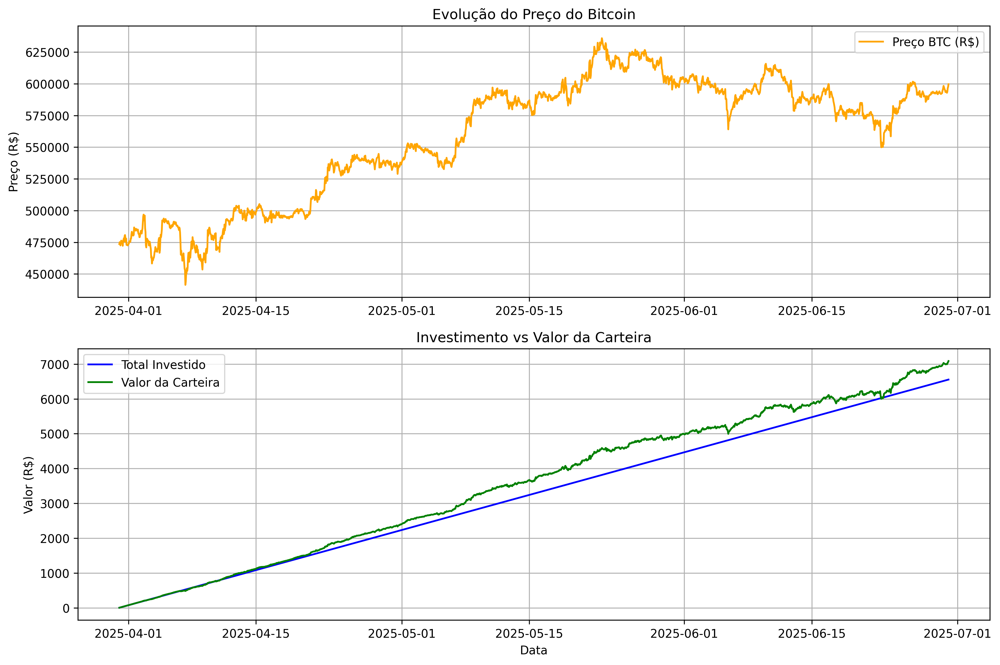

# Bitcoin DCA Backtesting

## 📊 Simulador de Investimentos em Bitcoin

Este projeto simula uma estratégia de Dollar Cost Averaging (DCA) para investimentos em Bitcoin, permitindo visualizar os resultados de investimentos periódicos ao longo do tempo, considerando taxas de transação.



## 🚀 Funcionalidades

- **Simulação de DCA**: Investe um valor fixo (R$ 3,00) a cada 6 horas em Bitcoin
- **Inclusão de taxas**: Considera taxa de 0,10% por transação
- **Análise detalhada**: Calcula rentabilidade, lucro/prejuízo e impacto das taxas
- **Visualização gráfica**: Gera gráficos da evolução do preço e valor da carteira
- **Exportação de dados**: Salva histórico completo em CSV para análises adicionais
- **Comparação**: Mostra diferença entre cenários com e sem taxas

## 📋 Requisitos

- Python 3.6+
- Bibliotecas necessárias (listadas no arquivo `requirements.txt`):
  - python-binance
  - pandas
  - numpy
  - matplotlib (opcional, para visualização gráfica)
  - cryptography (dependência da biblioteca python-binance)

## 🔧 Instalação

Você pode instalar todas as dependências necessárias usando o arquivo requirements.txt:

```bash
pip install -r requirements.txt
```

Ou instalar manualmente cada biblioteca:

```bash
pip install python-binance pandas numpy matplotlib cryptography
```

## 💻 Como usar

1. Clone este repositório:
   ```bash
   git clone https://github.com/seu-usuario/python-backtest-crypto.git
   cd python-backtest-crypto
   ```

2. Execute o script principal:
   ```bash
   python main_backtest.py
   ```

3. Analise os resultados no terminal e verifique os arquivos gerados:
   - `historico_investimento_bitcoin.csv`: Histórico detalhado de todas as transações
   - `analise_investimento_bitcoin.png`: Gráficos da evolução do investimento

## ⚙️ Personalização

Você pode modificar os seguintes parâmetros no código:

- **Período de análise**: Altere as variáveis `start` e `end`
- **Valor do investimento**: Modifique `investimento_por_compra`
- **Intervalo de tempo**: Altere `Client.KLINE_INTERVAL_6HOUR` para outros intervalos disponíveis
- **Taxa de transação**: Ajuste `taxa_transacao` conforme necessário
- **Par de trading**: Modifique `'BTCBRL'` para outros pares como `'BTCUSDT'`

## 📈 Métricas Analisadas

- Total investido
- Bitcoin acumulado
- Valor atual da carteira
- Lucro/Prejuízo
- Rentabilidade percentual
- Total gasto em taxas
- Impacto das taxas no resultado final
- Preço médio de compra (com e sem taxas)

## 📝 Notas

- Os dados históricos são obtidos da API da Binance
- As datas no código são configuradas para um período específico e podem precisar ser ajustadas
- Este é um projeto educacional e não constitui recomendação de investimento

## 📦 Estrutura do Projeto

- `main_backtest.py`: Script principal com a lógica de simulação
- `requirements.txt`: Lista de dependências do projeto
- `historico_investimento_bitcoin.csv`: Arquivo gerado com o histórico de transações
- `analise_investimento_bitcoin.png`: Gráficos gerados pela simulação

## 🤝 Contribuições

Contribuições são bem-vindas! Sinta-se à vontade para abrir issues ou enviar pull requests com melhorias.
